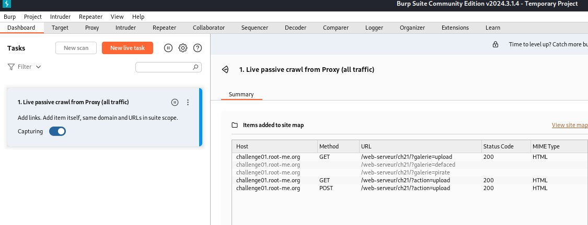
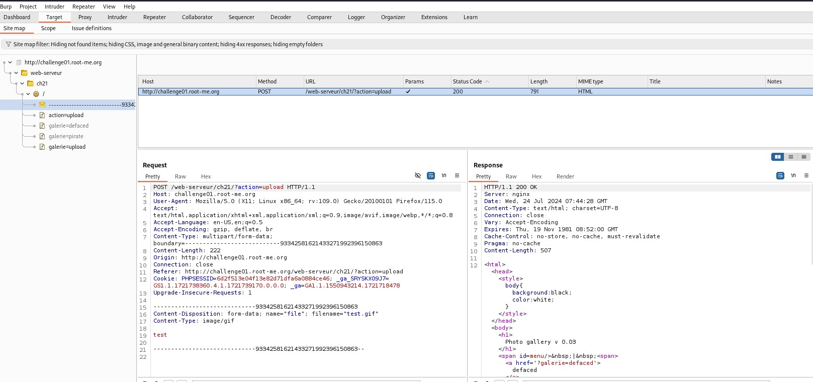
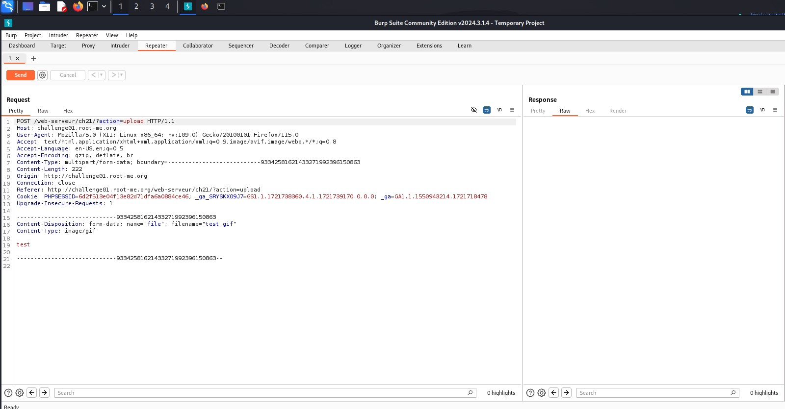
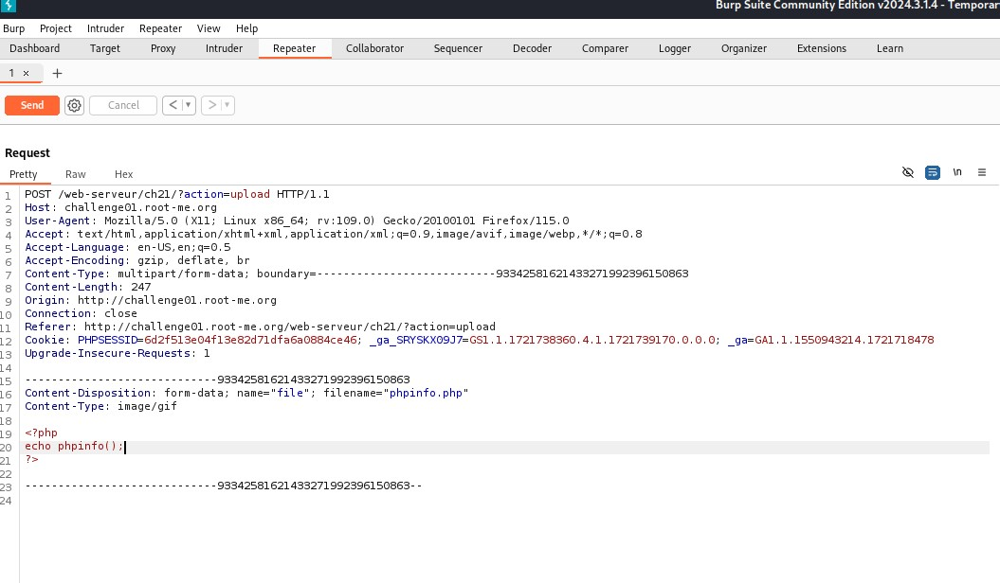

### Challenge: File upload - Type MIME

Url :  https://www.root-me.org/fr/Challenges/Web-Serveur/File-upload-Type-MIME

**Enoncé :**
 Votre objectif est de compromettre cette galerie photo en y uploadant du code PHP.
Récupérez le mot de passe de validation dans le fichier .passwd à la racine de l’application.

Writeups: 

**Etape 1 :**

En lisant le pdf fournit par le challenge root me, on nous explique que fournir une fonction de téléchargement de fichiers sans ouvrir de failles de sécurité s'est avéré être un véritable défi dans les applications Web PHP.

j'ai donc essayé d'uploader un shell.php proposer par p0wny-shell disponible sur le web.

via l'url http://challenge01.root-me.org/web-serveur/ch21/?galerie=pirate 

On constate que les seul fichier authorisés à être uplodé sont les .gif .png .jpg

J'ai donc essayé d'uploader le shell.php renommé en shell.php.gif
ce qui n'a pas été concluant non plus car par la suite il m'était impossible de lire le code php.

**Etape 2 :**

Je me suis renseigné sur comment exécuter des commandes en php et pouvoir injecté du php sur un site web et via quel outil. J'ai trouvé qu'il était possible d'utiliser le logiciel Burp Suite dispo sur KAli.

Dans un premier temps j'ai configuré firefox en mode proxy pour que burp suite puisse fonctionner en écoute.

j'ai décidé d'uploader un fichier vide nommé test.gif afin de voir comment était écrite la requète en la récupérant dans Burp Suite.

**Exemple  de requète POST après avoir été capturé dans Burp Suite:**



Dans la documentation on nous explique qu'il est facilement possible de contourner la vérification MIME. Seul l'extension du fichier est vérifié mais pas le contenu. Il est donc possible de copier du code php ou python et de l'injecté avec "Burp suite".

Pour ce faire, on va utiliser la requète POST récupéré dans le Dashboard et utiliser la fonction repeater de Burp Suite.

effectuer un clic droit sur la requète POST et sélectionner send to the repeater.


C'est à partir de l'onglet repeater que l'on va pouvoir copier du code php et l'envoyer sur l'url que l'on a décider d'attaquer en utilisant la requète POST.



La ou est écrit test sur l'image est l'endroit ou nous allons pouvoir écrire le code php, afin de lui faire exécuter les commandes que nous souhaitons.

On peut utiliser par exemple:
```
<?php
echo phpinfo();
?>
```
Pour obtenir des informations utiles comme l'open_basedir.
open_basedir	/challenge/web-serveur/ch21


ATTENTION! Il est obligatoire de changer le nom du fichier à chaque nouvelle requète envoyée. ici en l'occurance test.gif à été renomé en phpinfo.php, bien vérifier de mettre l'extension .php afin de pouvoir éxécuter le code.

Ne pas oublier une fois le code écrit de cliquer sur "Send" pour envoyer l'attaque au serveur. (icone en orange en haut à gauche de l'écran)

**Etape 3 :**

Au début dans le challenge on nous dit que le fichier contenant le mot de passe se trouve à la racine de l'application.


En envoyant la requète avec la commande "ls -la" on connait ou se trouve le fichier uploader et on peut donc faire un cat à la racine de l'application, sachant que l'application est ch21. Le chemin se trouve dans l'url challenge01.root-me.org/web-serveur/ch21/galerie/upload/6d2f513e04f13e82d71dfa6a0884ce46/ pour se retrouver à la racine il sufit de faire un retour en arrière de 3 répertoire. ../../../
c'est pour cela que nous utilisons cette commande cat ../../../.passwd

```
<?php
// Executes, returns only last line of the output
echo exec("ls -la");
?>
```

http://challenge01.root-me.org/web-serveur/ch21/galerie/upload/6d2f513e04f13e82d71dfa6a0884ce46//ls.php

```
<?php
echo exec("cat ../../../.passwd");
?>
```

